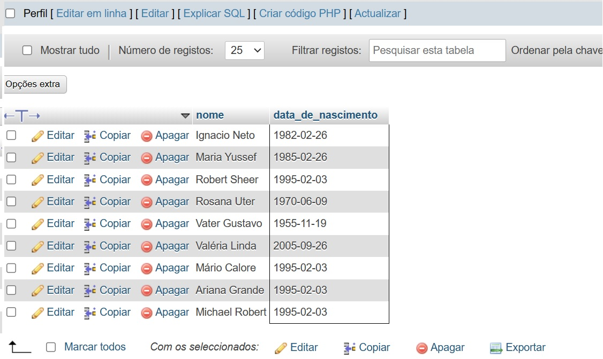
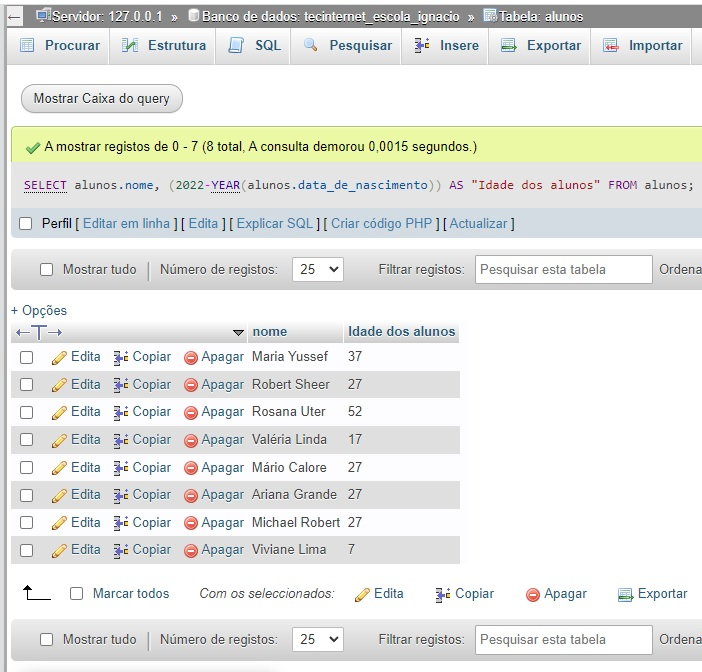

## Modelagem física

### Criar banco de dados
```sql

CREATE DATABASE tecdev_escola_vinicius CHARACTER SET utf8mb4;

```
<!-- ____________________________________________________________________ -->
### Criar tabela cursos
```sql

CREATE TABLE cursos(
    id SMALLINT NOT NULL PRIMARY KEY AUTO_INCREMENT,
    titulo VARCHAR(30) NOT NULL,
    carga_horaria SMALLINT NOT NULL,
    professor_id SMALLINT
);


```
<!-- ____________________________________________________________________ -->
### Criar tabela professores
```sql

CREATE TABLE professores(
    id SMALLINT NOT NULL PRIMARY KEY AUTO_INCREMENT,
    nome VARCHAR(50) NOT NULL,
    area_de_atuacao ENUM('design','desenvolvimento','infra') NOT NULL,
    curso_id SMALLINT
);


```
<!-- ____________________________________________________________________ -->
### Criar tabela alunos
```sql

CREATE TABLE alunos(
    id SMALLINT NOT NULL PRIMARY KEY AUTO_INCREMENT,
    nome VARCHAR(50) NOT NULL,
    data_de_nascimento DATE NOT NULL,
    primeira_nota DECIMAL (4,2) NOT NULL,
    segunda_nota DECIMAL (4,2) NOT NULL,
    curso_id SMALLINT
);


```
<!-- ____________________________________________________________________ -->
### Criação da chave estrangeira (relacionamento entre as tabelas)

```sql
-- Criação das chaves estrangeiras (Exercício)
ALTER TABLE cursos
    ADD CONSTRAINT fk_cursos_professores
    FOREIGN KEY(professor_id) REFERENCES professores(id);

ALTER TABLE professores
    ADD CONSTRAINT fk_professores_cursos
    FOREIGN KEY(curso_id) REFERENCES cursos(id);

ALTER TABLE alunos
    ADD CONSTRAINT fk_alunos_cursos
    FOREIGN KEY(curso_id) REFERENCES cursos(id);

<!-- ____________________________________________________________________ -->
-- Inclusão dos cursos (5 cursos:) Etapa 2
INSERT INTO cursos (titulo, carga_horaria) VALUES(
    'Front-End',
    40
    ),
(
    'Back-End',
    80
    ),
(
    'UX/UI Design',
    30
),
(
    'Figma',
    10
),
(
    'Redes de Computadores',
    100
);

```
<!-- ____________________________________________________________________ -->
### cadastro dos (5 professores) Etapa 2

```sql
INSERT INTO professores (nome, area_de_atuacao, curso_id) VALUES(
    'Jon Oliva',
    'infra',
    5
    ),
(
    'Lemmy Kilmister',
    'design',
    4
    ),
(
    'Neil Peart',
    'design',
    3
    ),
(
    'Ozzy Osbourne',
    'desenvolvimento',
    2
    ),
(
    'David Gilmour',
    'desenvolvimento',
    1
    );
-- Atualização de Id´s

UPDATE cursos SET professor_id = 1 WHERE id = 5;
UPDATE cursos SET professor_id = 2 WHERE id = 4;
UPDATE cursos SET professor_id = 3 WHERE id = 3;
UPDATE cursos SET professor_id = 4 WHERE id = 2;
UPDATE cursos SET professor_id = 5 WHERE id = 1;

-- Cadastro dos alunos

INSERT INTO alunos (nome, data_de_nascimento,primeira_nota, segunda_nota, curso_id) VALUES(
    'Ignacio Neto',
    '1982-02-26',
    8,
    10,
    3
    ),
(
    'Maria Yussef',
    '1985-02-26',
    9,
    10,
    2
    ),
(
    'Robert Sheer',
    '1995-02-03',
    9,
    7,
    5
),
(
    'Rosana Uter',
    '1970-06-09',
    10,
    10,
    1
),
(
    'Vater Gustavo',
    '1955-11-19',
    9,
    9,
    4
),
(
    'Valéria Linda',
    '2005-09-26',
    4,
    7,
    2
),
(
    'Mário Calore',
    '1995-02-03',
    10,
    7,
    3
),
(
    'Ariana Grande',
    '1995-02-03',
    8,
    3,
    4
),
(
    'Michael Robert',
    '1995-02-03',
    9,
    9,
    1
),
(
    'Viviane Lima',
    '2015-01-01',
    10,
    9,
    3
);


```
<!-- ____________________________________________________________________ -->
### Consultas (Etapa 3)

### 1) Faça uma consulta que mostre os alunos que nasceram antes do ano 2009
```sql

-- 5ª Digitação (SQL para criar a consulta acima)

```


<!-- _________________________ -->
### 2) Faça uma consulta que calcule a média das notas de cada aluno e as mostre com duas casas decimais.
```sql

SELECT nome, primeira_nota, segunda_nota, ROUND(AVG((primeira_nota + segunda_nota) / 2), 2) AS "Média das notas"  from alunos GROUP BY nome;


```


<!-- _________________________ -->
### 3) Faça uma consulta que calcule o limite de faltas de cada curso de acordo com a carga horária. Considere o limite como 25% da carga horária. Classifique em ordem crescente pelo título do curso.
```sql

-- 7ª Digitação (SQL para criar a consulta acima)

```


<!-- _________________________ -->

### 4) Faça uma consulta que mostre os nomes somente dos professores da área de desenvolvimento.
```sql

SELECT nome, area_de_atuacao FROM professores WHERE area_de_atuacao LIKE "%desenvolvimento%";

```

<!-- _________________________ -->

### 5) Faça uma consulta que mostre a quantidade de professores por área de desenvolvimento.
```sql

-- 9ª Digitação (SQL para criar a consulta acima)

```


<!-- _________________________ -->

### 6) Faça uma consulta que mostre o nome dos alunos, o título e a carga horária dos cursos que fazem.
```sql

SELECT alunos.nome, cursos.titulo, cursos.carga_horaria FROM alunos INNER JOIN cursos ON alunos.curso_id = cursos.id;

```


<!-- _________________________ -->
### 7) Faça uma consulta que mostre o nome dos professores e o título do curso que lecionam. Classifique pelo nome do professor.
```sql

-- 11ª Digitação (SQL para criar a consulta acima)

```


<!-- _________________________ -->
### 8) Faça uma consulta que mostre o nome dos alunos, o título dos cursos que fazem, e o professor de cada curso.
```sql

SELECT alunos.nome, cursos.titulo, professores.nome AS "Nome professor" FROM alunos LEFT JOIN cursos ON alunos.curso_id = cursos.id LEFT JOIN professores ON professores.curso_id = cursos.id;

-- Explicação

-- Esta consulta SQL combina informações de três tabelas diferentes, utilizando a cláusula LEFT JOIN para garantir que todas as linhas da tabela "alunos" sejam incluídas na saída, mesmo que não haja correspondências nas tabelas "cursos" e "professores".

-- A tabela à esquerda é a tabela alunos, que contém informações sobre os alunos.

-- A tabela à direita é uma CTE (Common Table Expression) chamada CursoProfessor,  está sendo usada para representar uma tabela virtual que combina informações sobre os cursos e, quando possível, o nome do professor associado a cada curso.

```


<!-- _________________________ -->
### 9) Faça uma consulta que mostre a quantidade de alunos que cada curso possui. Classifique os resultados em ordem descrecente de acordo com a quantidade de alunos.
```sql

-- 13ª Digitação (SQL para criar a consulta acima)

```


<!-- _________________________ -->
### 10) Faça uma consulta que mostre o nome dos alunos, suas notas, médias, e o título dos cursos que fazem. Devem ser considerados somente os alunos de Front-End e Back-End. Mostre classificados pelo nome do aluno.
```sql

SELECT alunos.nome, primeira_nota, segunda_nota, ROUND(AVG((primeira_nota + segunda_nota) / 2), 2) AS "Média das notas", cursos.titulo AS titulo from alunos INNER JOIN cursos ON alunos.curso_id = cursos.id WHERE curso_id IN(1,2) GROUP BY nome ORDER BY titulo;

```


<!-- _________________________ -->
### 11) Faça uma consulta que altere o nome do curso de Figma para Adobe XD e sua carga horária de 10 para 15.
```sql

-- 15ª Digitação (SQL para criar a consulta acima)

```


<!-- _________________________ -->
### 12) Faça uma consulta que exclua um aluno do curso de Redes de Computadores e um aluno do curso de UX/UI.
```sql

-- Excluindo um aluno do curso de Redes de Computadores
DELETE FROM alunos WHERE nome = 'Robert Sheer' AND curso_id = 5;

-- Excluindo um aluno do curso de UX/UI
DELETE FROM alunos WHERE nome = 'Mário Calore' AND curso_id = 3;

```

<!-- _________________________ -->
### 13) Faça uma consulta que mostre a lista de alunos atualizada e o título dos cursos que fazem, classificados pelo nome do aluno.
```sql

-- 17ª Digitação (SQL para criar a consulta acima)

```

<!-- _________________________ -->
## DESAFIOS

### 1) Criar uma consulta que calcule a idade do aluno
```sql

SELECT alunos.nome, (2023-YEAR(alunos.data_de_nascimento)) AS "Idade dos alunos" FROM alunos;

```


<!-- _________________________ -->
### 2) Criar uma consulta que calcule a média das notas de cada aluno e mostre somente os alunos que tiveram a média **maior ou igual a 7**.
```sql

SELECT alunos.nome, primeira_nota, segunda_nota, 
ROUND(primeira_nota + segunda_nota)/ 2 AS "Média das notas" FROM alunos WHERE ((primeira_nota + segunda_nota) / 2) >= 7;

```


<!-- _________________________ -->
### 3) Criar uma consulta que calcule a média das notas de cada aluno e mostre somente os alunos que tiveram a média **menor que 7**.
```sql

-- 20ª Digitação (SQL para criar a consulta acima)

```


<!-- _________________________ -->

### 4) Criar uma consulta que mostre a quantidade de alunos com média **maior ou igual a 7**.
```sql

SELECT COUNT(((primeira_nota + segunda_nota) / 2)) As "QTD. de alunos" FROM alunos  WHERE ((primeira_nota + segunda_nota) / 2) >= 7;

```

